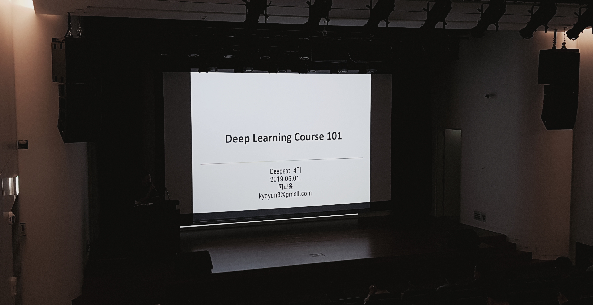

## Blockchains, Deep Learning in One Place.

{오늘 서울대학교 블록체인 학회 - 서울대 딥러닝 학회 조인트 학회 모임은 서울대 - 삼성전자 공동연구소에서 진행하였다.}

{강의 시작 전의 모습.}

[[Decipher, Deepest 두 학회가 만나, Blockchain, Deep Learning, 모두 한자리에서 들을 수 있습니다.]]{Lee su-young}

{Decipher에서 블록체인의 기초 및 응용에 대해서 발표해 주었다.}

{Deepest에서는 deep learning 강의 101으로 시작하였다.}

{이후 찍은 사진.}

2019.06.01 Photo Essay | Decipher - Deepest