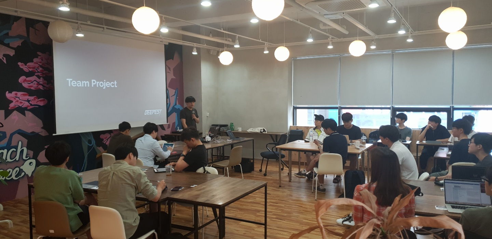

## Deepest Season 6 Orientation

{방금 진행한 orientation}

@[Deepest Project Github](media/67502997_907120362973439_2071077128991932416_o.jpg)(https://github.com/Deepest-Project/Hosting-School){호스팅 내용 리스트}

시작합니다! 	

## Getting to know the members

{간단히 자기소개 하는 중이다.}

{디피스트 스티커를 나눠주었다.}

@[Deepest Blog](media/image2.png)(https://github.com/Deepest-Project/Deepest-Project-Blog){여기 회원님들이 글을 올려주셔도 됩니다.}

Deepest 스티커를 나눠준다! 와아아아아아 😊😊😊

6기에 접어들면서 서울대만이 아닌 다른 KAIST, 연세대 등등 다른 실력자분들도 많이 오신 것을 느꼈고 또 각자의 주제에 대해 깊게 생각하고 있는 것이 느껴졌다.

중학교 3학년때부터 CNN을 공부해오던 컴공 1학년부터, 2차 전지에서 PDE를 대체하는 연구, Reinforcement Learning, NLP, Question Answering, Flow based Generative Model, 음성 합성 등등 여러 분야에 관심을 가지신 분들이 와 주셔서 이번 기수에서도 서로 배워가는 시간이 되었으면 좋겠다.

서로 자유롭게 연구하고 서로 돈도 많이 벌어서 Deepmind 수준의 infra를 갖추게 되면 좋겠다. 대학원생들은 과제 등을 하느라 바쁘고 회사원들도 업무가 있겠지만, AI 연구를 서로 협업하면서 재밌게 할 수 있는 방법이 있는 것 같다. Deepest에서 서로 다른 분야에서 mixing이 일어나고 교류가 활발했으면 좋겠다. 

!!

이런 연구도 디피스트에서 가능하다는 것을 보여주고 싶다!

[[Deepest 6기 시작합니다.]]{2019.07.20. BS타워 2층}

