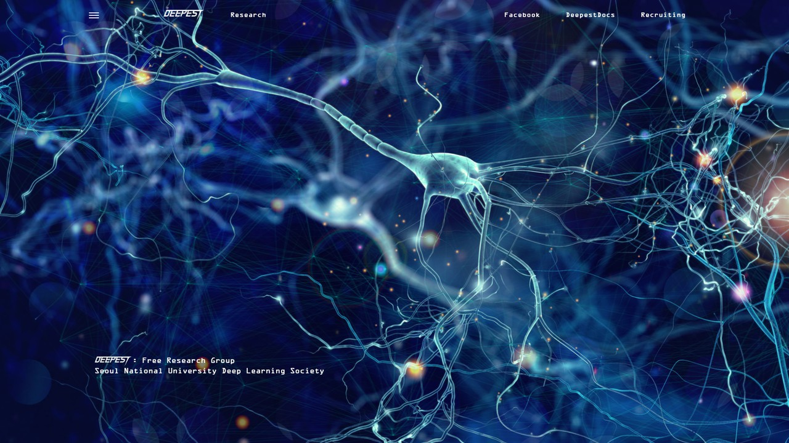
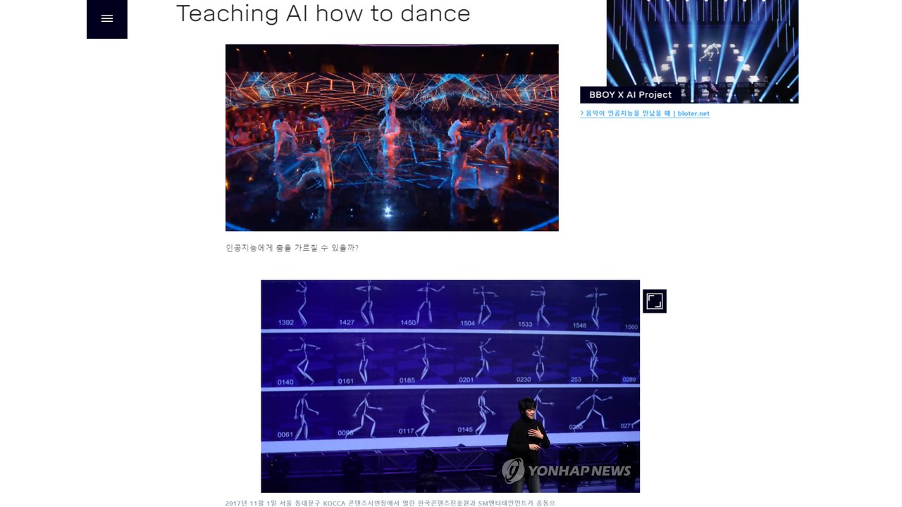
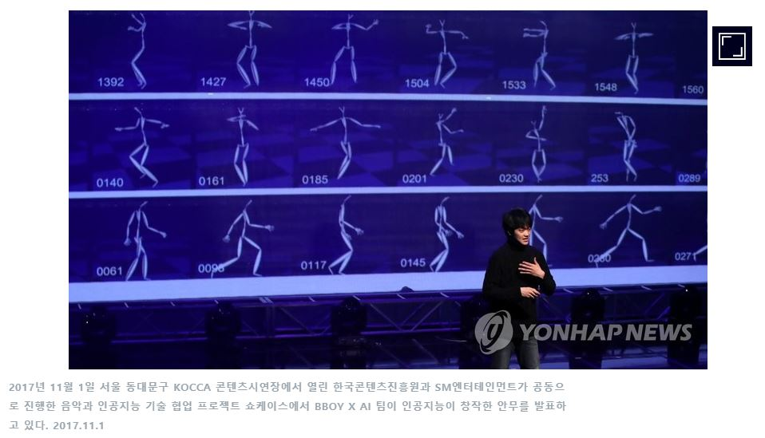
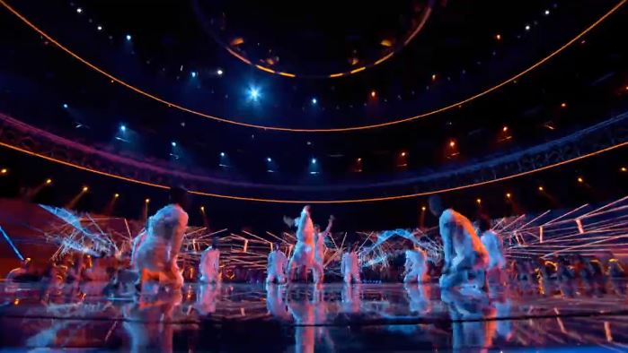
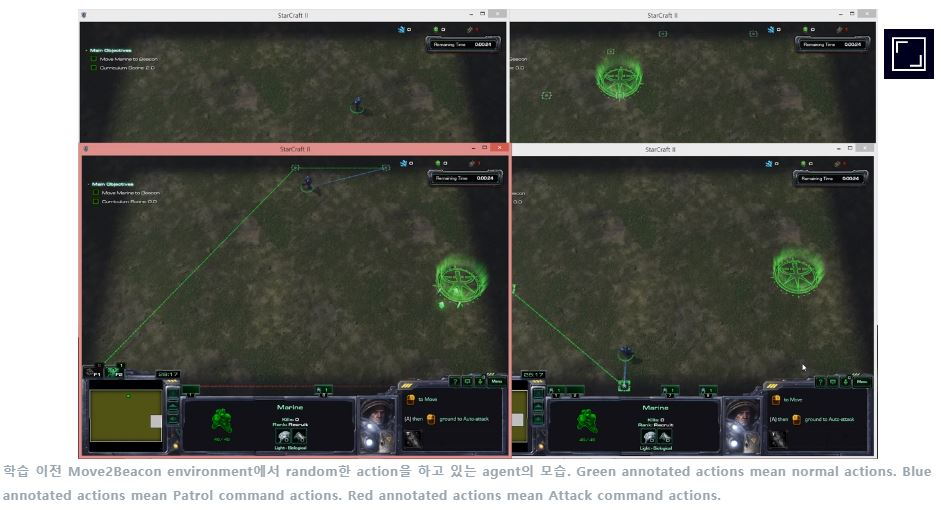
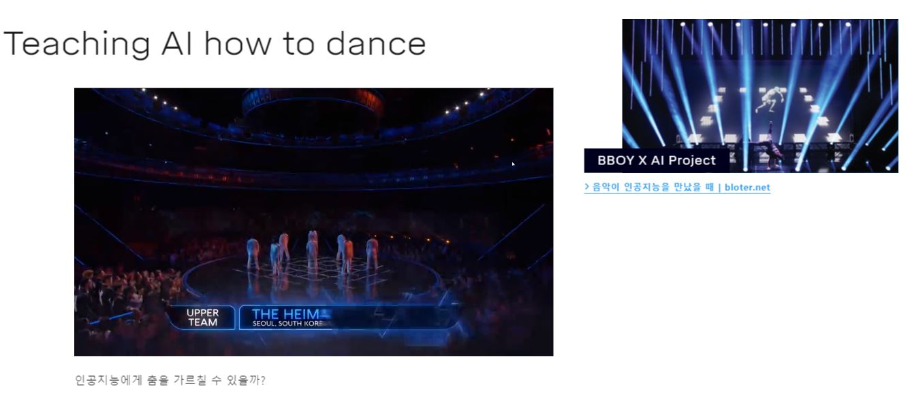
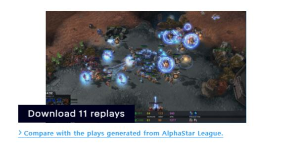
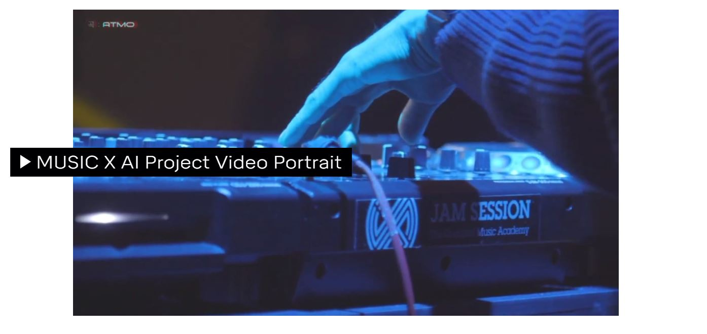
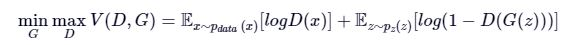

# Deepest.AI

2019-05-27 Deepest.AI 페이지가 2주년을 맞아 대대적인 update를 진행합니다. 그동안 낸 논문들이나 활동한 내역들 중에서 남들과 공유하고 싶은 것들이 있다면 멋지게 딥마인드 스타일의 `Deepest.AI` 블로그에 소개해보는 것을 어떨까요?






* 테스트 링크: https://test.deepest.ai/
* 링크(이후 이동 예정): https://deepest.ai/

Deepest blog는 `Deepest Markdown`을 통해서 만들어집니다. 기존의 Markdown과 비슷하지만 비디오도 올릴 수 있고 youtube link도 쉽게 추가할 수 있습니다.

음성 데이터 등 여러 형태의 데이터를 support할 예정입니다.


## Deepest markdown 양식

Deepest markdown은 기본적인 markdown 양식과 비슷하나 몇 가지를 수정하였습니다.


일반적으로 쓰시는 README 형식으로 올려주셔도 page rendering이 됩니다.

```
# section title

## subsection title

### subsubsection title


```

사실 여기까지만 해도 왠만한 문서는 작성 가능할 것으로 보입니다.

하지만! 비디오, 유튜브 링크 등 더 멋진 블로그 글을 위해서 다음과 같은 편리한 커스텀 마크다운을 만들었습니다.

여기에 추가적으로 다음과 같은 내용이 들어가게 됩니다.

```
{caption}

!

!{caption}

@[side link text](image src)(link){caption}

!!

[[quote]]{sayer}

$$LaTeX math equations$$

```

다음에 각 명령들이 실제로 어떻게 보이는지 알 수 있습니다. 

### caption

```
{caption}

```

테스트해보면 다음과 같이 나옵니다.

```
{2017년 11월 1일 서울 동대문구 KOCCA 콘텐츠시연장에서 열린 한국콘텐츠진흥원과 SM엔터테인먼트가 공동으로 진행한 음악과 인공지능 기술 협업 프로젝트 쇼케이스에서 BBOY X AI 팀이 인공지능이 창작한 안무를 발표하고 있다. 2017.11.1}
```




### video

```
!
```
extended deepest markdown에서는 video도 입력할 수 있게 됩니다. 



### video caption

```
!{caption}
```

video caption도 입력할 수 있습니다. 




### side link

```
@[side link text](image src)(link){caption}
```

우측 공간에 다른 사진, 캡션과 함께 링크를 달아줄 수 있습니다.

Example:
```
@[BBOY X AI Project](media/bboyxai.jpg)(https://www.bloter.net/archives/293757){음악이 인공지능을 만났을 때 | bloter.net}
```



다음과 같이 오른쪽에 유용한 다른 reference를 다는데 사용합니다.



페이지에서 어떻게 사용되었는지 확인하기 : https://deepest.ai/blog/alphastar-revisited


### youtube link

```
!!
```

유튜브 동영상을 자연스럽게 문서에 넣을 수 있습니다. 

youtube title : 라벨로 표시될 제목
id : youtube 링크의 id

Example:

```
!!
```



### LaTeX math equations

```
$$ \min_G \max_D V(D,G) = \mathbb{E}_{x\sim p_{data}~(x)}[log D(x)] + \mathbb{E}_{z\sim p_z(z)}[log(1-D(G(z)))] $$
```




## Deepest markdown 예시 및 데모

`[Example] 2019-05-26-dancing-with-ai/index.md`의 내용을 보자.

```
---
title : Breakdance X AI
cover : media/bboyxai.jpg
time : 20190526
author : Seiok Kim
description: "Breakdancing requires years of practice and constant innovation to create new movements. Using different medium such as LED lights, and always in search for inspiration, BBOY SEIOK PRODUCTION strives to generate new style of movement."
---


# Teaching AI how to dance

!

인공지능에게 춤을 가르칠 수 있을까?

@[BBOY X AI Project](media/bboyxai.jpg)(https://www.bloter.net/archives/293757){음악이 인공지능을 만났을 때 | bloter.net}


{2017년 11월 1일 서울 동대문구 KOCCA 콘텐츠시연장에서 열린 한국콘텐츠진흥원과 SM엔터테인먼트가 공동으로 진행한 음악과 인공지능 기술 협업 프로젝트 쇼케이스에서 BBOY X AI 팀이 인공지능이 창작한 안무를 발표하고 있다. 2017.11.1}

[[I am a breakdancer, and also an AI engineer.]]{Seiok Kim}

!!

### AI 그리고 예술

So how do we make new art?

Now I will talk in detail...

$$ \min_G \max_D V(D,G) = \mathbb{E}_{x\sim p_{data}~(x)}[log D(x)] + \mathbb{E}_{z\sim p_z(z)}[log(1-D(G(z)))] $$

good fellow...


```

결과는 다음에서 확인해 볼 수 있다.

* 테스트 링크 : https://test.deepest.ai/blog/dancing-with-ai
* 링크 (이후 이동 예정) : https://deepest.ai/blog/dancing-with-ai


다른 글 예시도 첨부하였다.

* 테스트 링크 : https://test.deepest.ai/blog/alphastar-revisited
* 링크 (이후 이동 예정) : https://deepest.ai/blog/alphastar-revisited