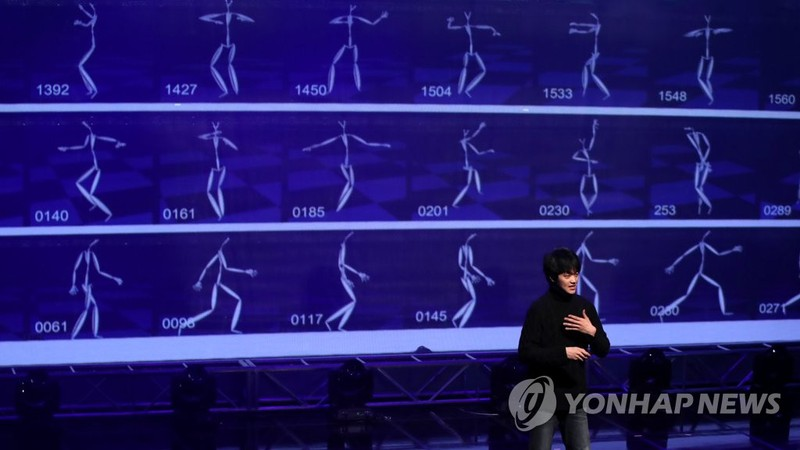

# Teaching AI how to dance

!

인공지능에게 춤을 가르칠 수 있을까?

@[BBOY X AI Project](media/bboyxai.jpg)(https://www.bloter.net/archives/293757){음악이 인공지능을 만났을 때 | bloter.net}

{2017년 11월 1일 서울 동대문구 KOCCA 콘텐츠시연장에서 열린 한국콘텐츠진흥원과 SM엔터테인먼트가 공동으로 진행한 음악과 인공지능 기술 협업 프로젝트 쇼케이스에서 BBOY X AI 팀이 인공지능이 창작한 안무를 발표하고 있다. 2017.11.1}

[[I am a breakdancer, and also an AI engineer.]]{Seiok Kim}

!!

### AI 그리고 예술

So how do we make new art?

Now I will talk in detail...

$$ \min_G \max_D V(D,G) = \mathbb{E}_{x\sim p_{data}~(x)}[log D(x)] + \mathbb{E}_{z\sim p_z(z)}[log(1-D(G(z)))] $$

good fellow...